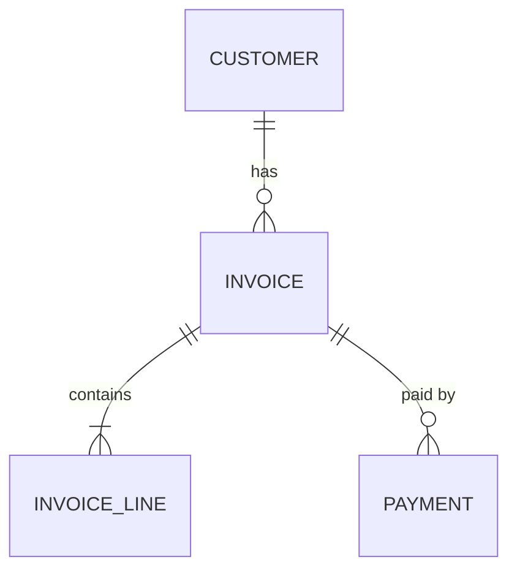

# Database schema design

## 1. From requirements to entities

1. List the nouns in the requirements (customer, invoice, line item, payment) and the questions the
   app must answer ("unpaid invoices per customer this month").
2. For each entity: its attributes, which are required, which must be unique, how it's identified.
3. For each relationship: one-to-one, one-to-many, many-to-many (needs a join table), and what
   happens on delete (cascade, restrict, set null).
4. Draw it as a Mermaid ER diagram in your answer or `docs/schema.md`:



## 2. Rules of thumb

- **Keys**: surrogate primary key per table (`bigint generated always as identity` or UUID v7/v4 if
  ids are exposed or generated client-side). Natural uniqueness (email, invoice number per company)
  gets a `UNIQUE` constraint as well.
- **Normalize to 3NF** by default: each fact stored once. Denormalize deliberately (caches, report
  tables) and document how it's kept in sync.
- **Types**: `text` (Postgres) over arbitrary `varchar(n)` unless a limit is a rule;
  `numeric(12,2)` or integer minor units for money (never float); `timestamptz` for moments;
  `date` for calendar days; `boolean` not 'Y'/'N'; `jsonb` only for truly schemaless extras.
- **Constraints are documentation that the database enforces**: `NOT NULL` by default, `CHECK`
  (`total >= 0`, `status in (...)`), foreign keys with explicit `ON DELETE`.
- **Enums**: a `CHECK` constraint or lookup table; Postgres `enum` types are fine but harder to change.
- **Multi-tenant**: put `org_id`/`tenant_id` on every tenant-owned table, include it in unique
  constraints and in the leading column of indexes.
- **Audit columns**: `created_at timestamptz not null default now()`, `updated_at`; soft delete
  (`deleted_at`) only if the product needs restore, and then filter it everywhere.
- **Naming**: `snake_case`, plural or singular consistently (pick what the project uses), FK columns
  `<table>_id`, indexes `<table>_<cols>_idx`.

## 3. Indexes

- Every foreign key column used in joins or filters.
- Composite indexes in the order of the query's equality filters, then range/sort:
  `(org_id, status, created_at desc)` serves `WHERE org_id=? AND status=? ORDER BY created_at DESC`.
- Partial indexes for hot subsets: `WHERE status = 'open'`.
- Don't index everything: each index slows writes. Justify each with a query.

## 4. Example (PostgreSQL)

```sql
create table customer (
  id bigint generated always as identity primary key,
  org_id bigint not null references org(id) on delete cascade,
  name text not null,
  email text,
  created_at timestamptz not null default now(),
  unique (org_id, email)
);

create table invoice (
  id bigint generated always as identity primary key,
  org_id bigint not null references org(id) on delete cascade,
  customer_id bigint not null references customer(id) on delete restrict,
  number text not null,
  status text not null default 'draft' check (status in ('draft','sent','paid','void')),
  issued_on date,
  due_on date check (due_on is null or issued_on is null or due_on >= issued_on),
  total numeric(12,2) not null default 0 check (total >= 0),
  created_at timestamptz not null default now(),
  unique (org_id, number)
);
create index invoice_org_status_due_idx on invoice (org_id, status, due_on);
```

## 5. Try it

Validate the DDL in SQLite or Postgres if available: `sqlite3 :memory: < schema.sql` catches syntax
errors for portable SQL; then insert a few rows and run the key queries.

## Review checklist

- [ ] Every table has a primary key and created_at.
- [ ] Required columns are NOT NULL; business uniqueness has UNIQUE constraints.
- [ ] Every FK has an index and a deliberate ON DELETE.
- [ ] Money and time types are correct.
- [ ] The main queries are served by indexes.
- [ ] Tenant isolation column on all tenant data.

## Done when

You have the DDL (or ORM models), an ER diagram, the list of main queries with the index serving
each, and notes on trade-offs. For changes to an existing database, continue with
`database-migrations`.
