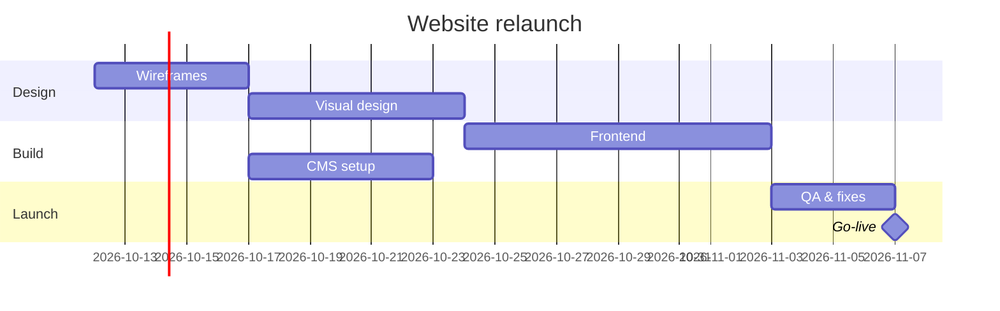

# Project management

## Project charter (one page)

Goal (outcome, not activity) · Success measures · Scope (in/out) · Deliverables · Milestones and
deadline · Budget · Stakeholders and decision-maker · Constraints · Key risks · Assumptions.

## Work breakdown

Break deliverables into work packages of 0.5–5 days that one person can own and finish. Each task:
verb + object ("Migrate customer table"), owner, estimate, dependencies, done-criteria.

## Timeline

Order tasks by dependencies, add estimates, find the critical path, add buffer (10–20%) on risky
tasks. Show it as a table and a Mermaid Gantt:



Or an Excel plan with columns: ID, task, owner, start, end, days, depends on, status, % done
(see `excel-spreadsheets`).

## RACI

| Activity | Maya (PM) | Raj (Eng) | Lena (Design) | CFO |
|---|---|---|---|---|
| Budget approval | R | C | I | A |

R = does it, A = accountable (one per row), C = consulted, I = informed.

## Risk register

| Risk | Likelihood (1–5) | Impact (1–5) | Score | Mitigation | Owner | Trigger |
|---|---|---|---|---|---|---|
| Key developer unavailable in Nov | 3 | 4 | 12 | Pair on critical tasks; document | Raj | Leave request |

Review weekly; act on score ≥ 12.

## Status report (weekly)

```markdown
# Website relaunch — status 7 Oct 2026  ·  Overall: 🟡 At risk
**Summary**: Design done; CMS setup 3 days late due to hosting access; go-live still 18 Nov if access arrives by Fri.
**Done this week**: wireframes approved; homepage design v1
**Next week**: visual design for 6 pages; CMS install
**Risks/issues**: hosting access (owner: IT, due Fri) — if late, go-live slips 1:1
**Decisions needed**: approve extra $800 for stock photos (Maya, by Thu)
**Milestones**: Design ✅ 10 Oct · Build 🟡 1 Nov · Launch ⏳ 18 Nov
```

Status colors must reflect facts (dates vs plan), with the reason in words.

## Retrospective

What went well · What didn't · What we'll change (owner + date). Blameless; focus on process.

## Connected tools

If Jira, Linear, Asana, monday.com or ClickUp is connected, read the real tasks there and create or
update issues (changes ask for approval) instead of retyping them.

## Done when

The plan has owners, estimates, dependencies and dates; risks are tracked; and status reporting
states progress against the plan honestly with clear asks.
