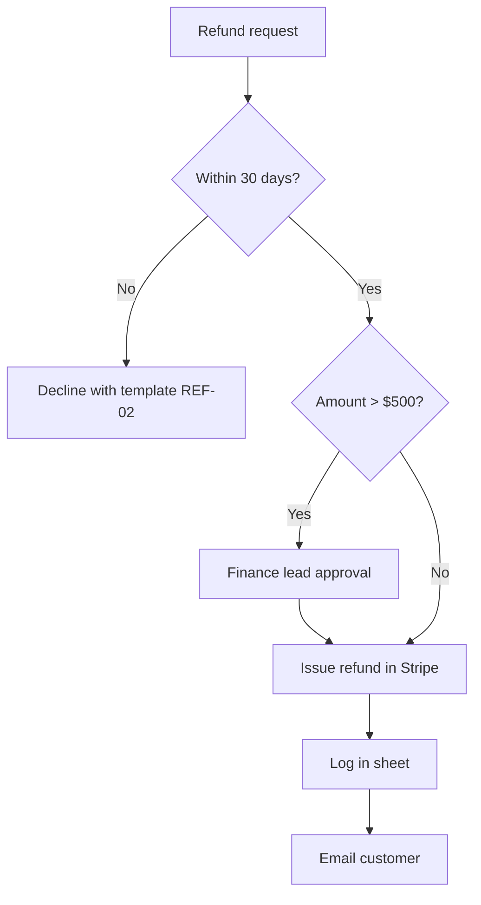

# SOPs and process documentation

An SOP is good when a new person can follow it alone and get the same result.

## Gather the process

From the person's description, an existing document, or a recording/transcript: the trigger (what
starts it), the steps, who does each, tools and systems used, inputs/outputs, decisions and
exceptions, how long it takes, and what "done" looks like. Ask about the steps people forget.

## SOP template

```markdown
# SOP: Processing a customer refund
**ID**: FIN-007 · **Owner**: Finance lead · **Version**: 1.2 · **Effective**: 7 Oct 2026 · **Review**: every 6 months

## Purpose
Why this exists, in one sentence.
## Scope
Applies to: card refunds under $500. Not covered: chargebacks (see FIN-009).
## Roles
Support agent (requests), Finance (approves and executes).
## Before you start
Access to Stripe and the refunds sheet; the order number.
## Steps
1. **Check eligibility** — order is within 30 days (Order → Details → Date). If not, follow step 7.
2. **Record the request** in the "Refunds 2026" sheet (columns: date, order, amount, reason, agent).
3. ...
## Exceptions
| Situation | What to do |
|---|---|
| Amount over $500 | Get approval from the Finance lead in #finance before step 4 |
## Quality check
- [ ] Refund visible in Stripe with the order number in the note
- [ ] Customer email sent (template REF-01)
## Records
Where evidence is kept and for how long.
## Change log
| Version | Date | Change | By |
```

## Writing rules

- One action per step, starting with a verb; exact button/field names in **bold**; expected result
  after key steps ("You'll see a green 'Refunded' label").
- Decisions as explicit branches ("If X, go to step 7").
- Include the why for steps people are tempted to skip.
- Keep it short; move background to an appendix.

## Process map



## Checklists

For frequent, short processes, a checklist is better than an SOP: 5–15 items, in order, each
verifiable. Daily/weekly/month-end checklists as Markdown or a spreadsheet with date columns.

## Deliver

Markdown, Word (`word-documents`) or PDF (`pdf-documents`) as requested; a folder structure for a
library of SOPs (`sops/finance/FIN-007-refunds.md`) with an index.

## Done when

Someone new could follow it without help: every step is actionable, exceptions are covered, roles
and quality checks are clear, and the version/owner are set.
