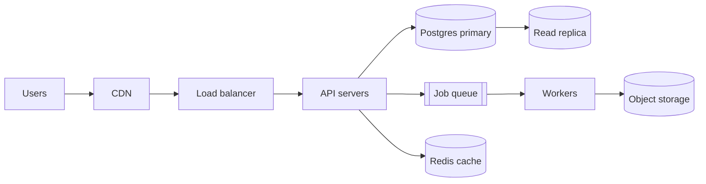

# System design

A design doc should let a reviewer decide whether to build it this way. Make the trade-offs explicit.

## 1. Requirements (write them down first)

- **Functional**: the user-visible capabilities, as a short list.
- **Non-functional**, with numbers: users and requests per second (average and peak), data size
  now and in 2 years, latency targets (p95), availability (99.9% = ~43 min/month down), durability,
  consistency needs, compliance (GDPR, data residency), budget and team skills.
- **Out of scope**: what this design deliberately doesn't do.

Back-of-envelope: 1M requests/day ≈ 12 rps average, plan for 5–10× peaks. 1 KB × 10M rows ≈ 10 GB.

## 2. High-level design

Start with the simplest architecture that meets the numbers (often: one web app, one Postgres, a job
queue, object storage, a CDN). Add components only with a stated reason.



For each component: responsibility, technology choice and why, how it scales, how it fails.

## 3. Deep dives

- **Data model**: main entities, keys, indexes for the hot queries, retention (see
  `database-schema-design`).
- **APIs**: the main endpoints or events with request/response shapes (see `backend-api`).
- **Key flows**: sequence diagrams for the 2–3 most important or risky operations.
  ```mermaid
  sequenceDiagram
    Client->>API: POST /orders
    API->>DB: insert order (pending)
    API->>Q: enqueue charge(order_id)
    Q->>Worker: charge
    Worker->>PSP: charge card (idempotency key)
    Worker->>DB: mark paid
  ```
- **Consistency**: where you need transactions, where eventual consistency is fine, idempotency for
  retries, how duplicates are prevented.
- **Scaling**: stateless app servers horizontally; caching (what, TTL, invalidation); read replicas;
  partitioning only when needed; async processing for slow work.
- **Reliability**: timeouts, retries with backoff, circuit breakers on dependencies, graceful
  degradation, backups and restore time, disaster recovery.
- **Security**: authentication, authorization model, secrets, encryption in transit/at rest, audit logs.
- **Observability**: metrics (rate, errors, duration), logs with request ids, traces, alerts.

## 4. Trade-offs

A table per major decision:

| Option | Pros | Cons | Verdict |
|---|---|---|---|
| Postgres queue (SKIP LOCKED) | No new infra, transactional | Throughput ceiling ~1k jobs/s | Chosen for v1 |
| Managed queue (SQS) | Scales, durable | New dependency, at-least-once semantics | Revisit at 10× load |

## 5. Plan

Milestones that each deliver something usable, the riskiest parts first, how to migrate from the
current system, and open questions.

## Done when

Requirements have numbers, the diagram matches the text, each component has a reason to exist,
failure modes and trade-offs are explicit, and open questions are listed.
